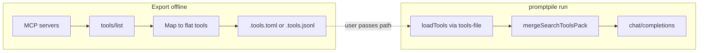

# promptpile-mcp

**promptpile** 的可选 **Model Context Protocol (MCP)** 适配层：把 MCP 服务器暴露的工具 Schema 转为 OpenAI Chat Completions 的 `tools` 形态，与 promptpile 现有「静态工具 + 合并扩展」流程衔接。

**当前状态**：本包为 **空脚手架**（`promptpile-mcp` CLI 可跑通；**未** 安装 `@modelcontextprotocol/sdk`、**未** 实现 `tools/list` / `tools/call` 等接线）。设计见下文，实现留待后续迭代。

---

## 目录

- [定位](#定位)
- [与 promptpile 的衔接点](#与-promptpile-的衔接点)
- [阶段 A：把 MCP 当作工具 Schema 提供者](#阶段-a把-mcp-当作工具-schema-提供者)
- [阶段 B：可选的执行路径](#阶段-b可选的执行路径)
- [配置形态](#配置形态)
- [集成方案](#集成方案)
- [安全](#安全)
- [后续待办](#后续待办)
- [开发与构建](#开发与构建)
- [许可证](#许可证)

---

## 定位

| 项目 | 说明 |
|------|------|
| **promptpile** | 从消息目录组装 `messages`，可选附带 `tools`，调用 **单次** `chat/completions`；**不执行**工具函数；工具历史通过 `[idx]assistant.call.jsonl` / `[idx]assistant.result.jsonl` 等文件还原。 |
| **本包** | 规划如何把 MCP 的 `tools/list` 映射为 Chat Completions 的 `function` 工具定义，以及如何（可选）通过 MCP 执行 `tools/call`；**不必**在首版修改 promptpile 行为即可通过「预生成工具文件」落地（见 [集成方案](#集成方案)）。 |

---

## 与 promptpile 的衔接点

实现 MCP 工具列表前，需对齐 promptpile 里已有的两条路径：

1. **静态工具加载** — [`packages/promptpile/src/tools-loader.ts`](../../promptpile/src/tools-loader.ts) 的 `loadTools()`：从 `.tools.toml` / `.tools.jsonl` 或 `TOOLS_FILE` / `--tools-file` 解析出 OpenAI 形的 `tools[]`。

2. **合并扩展** — [`packages/promptpile/src/tools-merge.ts`](../../promptpile/src/tools-merge.ts) 的 `mergeSearchToolsPack()`：在已有工具之后追加一批定义，并按 **`function.name` 去重**（已存在的名字不再追加）。

MCP 集成在语义上应贴近 **merge**：在 `mergeSearchToolsPack(tools)` **之后**（或与之一致的位置）合并 MCP 提供的工具，避免与静态工具、search pack 重名冲突。

---

## 阶段 A：把 MCP 当作工具 Schema 提供者

**目标**：在发起 Chat Completions 请求 **之前**，对已配置的 MCP 服务执行协议握手并拉取工具列表，映射为：

```json
{ "type": "function", "function": { "name": "...", "description": "...", "parameters": { ... } } }
```

其中 **`parameters`** 对应 MCP 工具条目中的 **`inputSchema`**（通常为 JSON Schema 对象），与 OpenAI function calling 约定一致。

**协议步骤**（每个 MCP server）：

1. 建立传输（首版以 **stdio** 为主：`command` + `args` 子进程）。
2. `initialize` → 就绪后 `tools/list`。
3. 将每条 MCP tool 转为一条 `ToolDefinition`（与 promptpile 中 `ToolDefinition` 用法一致）。

**命名与去重**：

- 多 server、多 tool 时易与 `.tools.toml` 或 search pack 中的 `name` 冲突。
- 建议默认启用稳定前缀：`mcp__<serverId>__<toolName>`（`<serverId>` 为配置中的逻辑 id，非进程 pid）。
- 可提供开关（例如 `flatNames: false`）在受控环境下关闭前缀（不推荐默认关闭）。

**失败策略**（可配置）：

- **strict**：任一 server `initialize` / `tools/list` 失败则整个 promptpile 退出。
- **best-effort**：跳过失败的 server，stderr 告警；至少一个 server 成功则继续。

---

## 阶段 B：可选的执行路径

promptpile 单次运行仍是一次补全；**执行**模型返回的 `tool_calls` 不在 core 内完成时，可选用以下方式之一：

| 方式 | 说明 |
|------|------|
| **手工 / 脚本结果文件** | 与现有约定一致：将工具结果写入 `[idx]assistant.result.jsonl`，下一轮消息中带 `tool` 角色。仓库内示例可参考 `example/promptpile-tool-test/scripts/execute-tool-call.ts`（模式：读调用 → 执行 → 写 result）。 |
| **after-hook 透传** | promptpile 完成后执行钩子；可将 `.calls.jsonl` 路径、消息目录等写入环境变量，由小型 **`mcp-exec`** 脚本读取每条 `tool_call`，对对应 MCP server 发 `tools/call`，再生成 result 文件供下次运行使用。 |
| **内置多轮 `--mcp-exec`**（远期） | 在 promptpile 进程内：若响应含 `tool_calls`，则循环连接 MCP、执行、拼接 `messages` 再请求，直到无工具调用或达到轮数上限。实现与安全审计成本高，**不建议与阶段 A 同步上线**。 |

---

## 配置形态

建议与 Cursor / 生态常见形态对齐，降低心智负担：

| 来源 | 说明 |
|------|------|
| **`.mcp.json`** 或 **`mcp.toml`** | 放在消息目录根或项目根；格式待定，至少包含 `servers` 映射。 |
| **环境变量** | 例如 `MCP_CONFIG` 指向配置文件绝对/相对路径。 |
| **CLI** | 例如 `--mcp-config <path>`。 |

**优先级**（与 promptpile 中 `TOOLS_FILE` 思路同构）：**CLI > 环境变量 > 默认路径**（仅在配置存在时启用 MCP）。

**每个 server 建议字段**：

| 字段 | 说明 |
|------|------|
| `command` / `args` | stdio 传输下的可执行文件与参数 |
| `env` | 可选，子进程环境 |
| `cwd` | 可选，工作目录 |
| `initTimeoutMs` / `listTimeoutMs` | 握手与列表超时 |

---

## 集成方案

**本仓库选定：方案 2** — 通过 CLI **预生成** `.tools.toml`（或 `.tools.jsonl`），再由 **promptpile** 用 `--tools-file` / `TOOLS_FILE` 加载。**不**把 MCP 合并逻辑写进 [`packages/promptpile/src/index.ts`](../../promptpile/src/index.ts)。

### 方案 2（选定）：零侵入 — 预生成工具文件

- `promptpile-mcp` 提供子命令（未来实现）：例如 `promptpile-mcp export-tools --config .mcp.json -o .tools.toml`。
- 流程：连接 MCP → `initialize` / `tools/list` → 映射为 flat 工具条目 → 写入与 [`packages/promptpile/src/tools-loader.ts`](../../promptpile/src/tools-loader.ts) 兼容的 TOML/JSONL。
- 用户运行 **promptpile** 时：`promptpile --tools-file .tools.toml ...`（或设置 `TOOLS_FILE`）。
- **优点**：不改 promptpile 源码；职责清晰（导出与补全分离）。
- **缺点**：工具列表非实时；MCP 侧增删改工具后需重新执行 export。



### 方案 1（未选）：库合并进 promptpile

在 [`packages/promptpile/src/index.ts`](../../promptpile/src/index.ts) 中于 `mergeSearchToolsPack(tools)` 之后调用 **`mergeMcpToolsPack(tools, options)`**：单次命令内动态拉取 MCP 工具并合并。

- **优点**：一条命令、工具列表始终最新。
- **缺点**：需改 promptpile、依赖与生命周期更重。

当前路线 **不采用** 方案 1；若将来产品需要「一体化 CLI」，可再评估。

---

## 安全

- **stdio MCP = 执行任意命令**：配置文件中的 `command` / `args` 必须与运行 promptpile 的用户权限一致；仅使用 **信任的** 配置与仓库。
- **敏感环境**：`env` 字段可能含密钥；避免把含密钥的配置提交到版本库。
- **网络类 MCP**（HTTP/SSE 等，若后续支持）：需 TLS、允许列表与超时，防止 SSRF / 资源耗尽。

---

## 后续待办

- [ ] 引入 `@modelcontextprotocol/sdk`（或等价实现），完成 stdio client 与 `initialize` / `tools/list`。
- [ ] 实现 `mergeMcpToolsPack`（或独立 export CLI）与配置解析。
- [ ] 与 promptpile 主流程接线（方案 1）或完善 export 子命令（方案 2）。
- [ ] （可选）文档化 after-hook 环境变量约定与示例 `mcp-exec` 脚本。

---

## 开发与构建

```bash
cd packages/promptpile-mcp
npm install
npm run build
```

本地 CLI：

```bash
npx promptpile-mcp --help
```

当前运行仅输出脚手架提示，无 MCP 行为。

---

## 许可证

ISC
