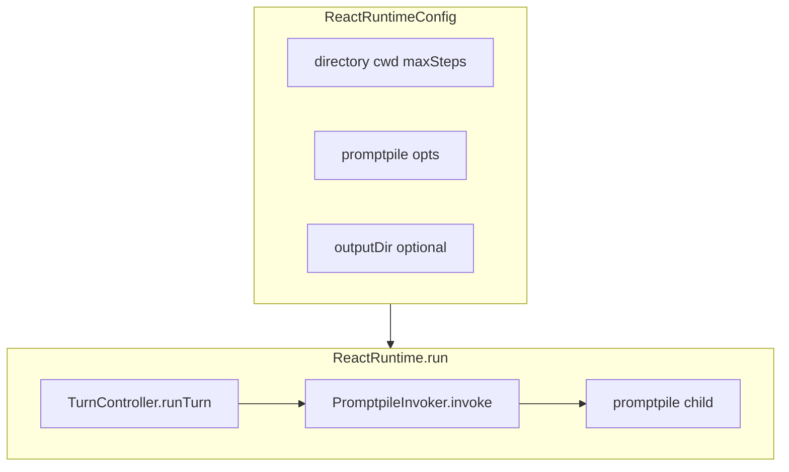

# promptpile-react 实现方案（设计说明与待办）

本文档汇总 **架构决策、与 `promptpile` 的边界、文件约定、Runtime 分层、CLI、分阶段落地顺序、风险与测试**。实现时以仓库内实际代码为准同步修订本文。

---

## 1. 目标与原则

### 1.1 产品目标

- 在 **`promptpile` 单次 Chat Completions 调用** 之上，提供 **ReAct 式多轮编排**：反复「拼消息 → 调模型 → 若有工具则产生观察 → 再调模型」，直到满足终止条件或达到步数上限。
- **不重写** OpenAI 请求/流式/`tool_calls` 解析等与 `promptpile` 重复的逻辑；编排层通过 **子进程调用 `promptpile`** 或（未来可选）库 API 复用完成。
- **协议类提示词**（B 类）与 **任务类提示词**（A 类）分离的设计思想见 [`packages/promptpile-react.md`](../promptpile-react.md)。

### 1.2 核心原则（与讨论结论对齐）

1. **子进程优先**：与当前 [`src/forward-cli.ts`](src/forward-cli.ts) 一致，通过 `node <promptpile>/dist/index.js` + 转发 argv 调用 `promptpile`，便于与命令行行为完全一致、便于调试。
2. **每轮建议固定使用 `-o`**：保证本轮主输出与（若存在）**`{basename}.calls.jsonl`** 落盘路径稳定，编排器只读文件系统即可拿到 `tool_calls` 侧车；**不在 react 内手写** OpenAI 的 `tool_calls` 落盘格式。
3. **是否允许模型发起工具调用**：通过 **`--tool-choice` / `TOOL_CHOICE`** 控制（`none` | `auto` | `required` | `function:<name>`），语义以 [`packages/promptpile/README.md`](../promptpile/README.md) 为准；**与 `-o` 正交**（不要用「不传 `-o`」代替 `tool_choice`）。
4. **工具落地**：推荐 **与 `promptpile` after-hook 同构**——每轮（或按需）**spawn 外部脚本**，由脚本根据 `PROMPTPILE_*` 等环境变量，写入 **`[idx]assistant.result.jsonl`**（及必要时 **`[idx]assistant.call.jsonl`**），格式与 promptpile README、[`file-handler.ts`](../promptpile/src/file-handler.ts) 一致。
5. **点文件协议**：`-d` 根目录下 **`.react.core.md` / `.react.obs.md` / `.react.final.md`** 由 [`src/react-dot-prompts.ts`](src/react-dot-prompts.ts) 的 `loadReactDotPrompts` 读取；Core/Obs 有中文内置默认；Final **无内置**，`final === ''` 表示不注入终稿协议、循环侧据此不进入「最终答案」分支。

---

## 2. 名词与文件类型对照

避免混用两种「calls」概念：

| 名称 | 路径规律 | 谁写入 | 用途 |
|------|-----------|--------|------|
| **主输出侧车 `*.calls.jsonl`** | 与 `-o` 主文件同目录：`path.parse(主输出).name + ".calls.jsonl"` | **`promptpile`**（存在 `-o` 且 API 返回非空 `tool_calls`） | 本轮 API 的 tool 调用列表（一行一个 JSON）。react **只读**，不自写该结构。 |
| **`[idx]assistant.call.jsonl`** | `-d` 扫描树内，匹配 `file-handler` 文件名规则 | **人工 / after-hook / react 调用的脚本**；**不是** promptpile 主流程在 API 成功后自动写入 | 作为**历史** assistant 消息（带 `tool_calls`）进入 `buildMessages`。 |
| **`[idx]assistant.result.jsonl`** | 同上 | **外部脚本（推荐）** | 与 call 中 `tool_call_id` 对齐的 `tool` 行内容。 |

**结论**：侧车 **`{basename}.calls.jsonl`** 交给 **带 `-o` 的 promptpile**；若下一轮要把工具结果纳入 **scan 后的 messages**，必须在 **`-d` 目录**（或 staging 等价物）中维护 **`assistant.call` / `assistant.result`** 文件语义，与 promptpile 文档一致。

---

## 3. 与 `promptpile` 的集成面

### 3.1 本包已有或待接能力

| 能力 | 位置 | 说明 |
|------|------|------|
| 转发 argv（用户侧不传 `-o`） | [`src/forward-cli.ts`](src/forward-cli.ts) | `buildPromptpileForwardArgs`、`resolvePromptpileEntry`、`childEnvWithoutOutputFile`、`runPromptpileForward`。当前子进程 **stdio: inherit**；要解析 JSON stdout，Invoker 需改为 **pipe** 并收集输出。 |
| `--tool-choice` | 同上 | 已并入转发；Runtime 每轮传入或覆盖。 |
| 点文件协议 | [`src/react-dot-prompts.ts`](src/react-dot-prompts.ts) | `loadReactDotPrompts(directory, cwd?)`。 |
| Runtime 占位 | [`src/runtime/`](src/runtime/) | 类型、`ReactRuntime`、`Stub*`；待接真实 Invoker / Turn / `run()`。 |

### 3.2 不在本包重复实现

- HTTP、`tool_calls` 流式合并、**写 `{basename}.calls.jsonl`**：均在 `packages/promptpile`。
- `scanDirectory` / `buildMessages` / `loadTools`：在 promptpile；子进程路径下间接使用。

### 3.3 `after-hook` 与多轮

- 见 [`packages/promptpile/src/after-hook.ts`](../promptpile/src/after-hook.ts)：`resolveAfterHookScript`、`buildPromptpileHookEnv`、`runAfterHook`；API 成功且写完主输出与侧车（及可选 `--continue`）后执行。
- **方案 A**：每轮子进程仍传 **`--after-hook-path`**，由 promptpile 在**本轮结束**时调钩子；钩子内根据 `PROMPTPILE_TOOL_CALLS` / `PROMPTPILE_CALLS_FILE` 写 **`[idx]assistant.result.jsonl`** 等，须 **幂等**、序号规则写死。
- **方案 B**：不传 promptpile 内置钩子，由 **react 在解析 stdout 后** 自行 `spawn` 脚本并注入与 `buildPromptpileHookEnv` **对齐的 env**，调用时机完全由 react 控制。

可二选一或组合（简单场景 A，复杂编排 B）。

---

## 4. Runtime 主体结构

| 符号 | 文件 | 目标职责 |
|------|------|-----------|
| 配置与状态 | [`src/runtime/types.ts`](src/runtime/types.ts) | `ReactRuntimeConfig`、`ReactRuntimeState`、`ReactRuntimeResult`、`TurnContext`、`TurnOutcome`、`ParsedTurnOutput`；实现中可增字段（如 `lastCallsPath`）。 |
| `ToolExecutor` | [`src/runtime/tool-executor.ts`](src/runtime/tool-executor.ts) | 可选；若坚持「零 in-process 业务」，可提供 **仅 spawn 脚本** 的适配类，或长期不用该接口、只靠钩子。 |
| `PromptpileInvoker` | [`src/runtime/promptpile-invoker.ts`](src/runtime/promptpile-invoker.ts) | **真实实现**：`spawnSync`/`spawn`、`process.execPath`、`resolvePromptpileEntry()`、`buildPromptpileForwardArgs`、**每轮 `-o`**、`stdio` pipe、`env` 在 `childEnvWithoutOutputFile` 基础上合并。 |
| `TurnController` | [`src/runtime/turn-controller.ts`](src/runtime/turn-controller.ts) | **单轮**：准备目录 → invoke → 解析 stdout → 可选读侧车 → 触发写 result / 依赖钩子 → 返回 `continue` / `done` / `abort`。 |
| `ReactRuntime` | [`src/runtime/react-runtime.ts`](src/runtime/react-runtime.ts) | **循环**：`while (step < maxSteps)` 调 Turn；维护 state；返回 `ReactRuntimeResult`。 |

---

## 5. CLI 设计（扩展建议）

1. **子命令**（择一）：`promptpile-react run` 进入 ReAct；`promptpile-react forward` 保持当前「单次转发」行为，便于对照调试。
2. **建议新增参数**
   - `--max-steps <n>`：映射 `ReactRuntimeConfig.maxSteps`。
   - `--react-output-dir <path>`：每轮 `-o` 主文件的父目录；其下生成唯一 basename（如 `turn-000.txt`），侧车为 `turn-000.calls.jsonl`。
   - 可选：`--react-tool-hook <path>`：react 自行 spawn 的脚本（若不只用 `promptpile --after-hook-path`）。
3. **`-i`**：多轮下与 stdin 交互易卡住，默认禁用或文档明示限制。

---

## 6. 工作区策略（须定案）

### 方案 A：原地 `-d`

- **优点**：无拷贝、实现快。
- **缺点**：写 `[idx]assistant.*` 或注入 system 时与用户文件 **序号冲突**；须约定规则或工具函数计算 `nextIdx`（参考 promptpile `appendAssistantMessage`）。

### 方案 B：staging 目录

- 从用户 `-d` **拷贝或链接**到临时工作目录，本轮所有写入只动 staging，再 `promptpile -d <staging>`。
- **优点**：隔离用户源目录。
- **缺点**：I/O、路径、Windows 下链接限制。

**建议**：首版 **A**；并发或怕污染源目录时改 **B**。定案后在本文本节注明。

---

## 7. B 类协议注入到「promptpile 可扫描的 messages」

`loadReactDotPrompts` 产出的是 **字符串**，要进入 API 的 `messages`，必须变为符合 `^\[(\d+)\](.+?)\.(md|json)$` 的文件，或合并进已有 `[n]system.md`。

**必须文档化**（README + 本节）：例如协议占用 **固定序号区间**（低序号），用户对话从高序号起；或 **staging 合并** 为单条 `[0]system.md`。实现后把**最终规则**写回本节。

---

## 8. 单轮 Turn 详细流水线（建议）

假定 **`--format json`**（首版可强制，避免流式解析重复劳动）。

1. `dotPrompts = loadReactDotPrompts(directory, cwd)`（staging 则对 staging 根目录）。
2. 按第 6、7 节将 `core` / `obs` /（若非空）`final` 反映到文件系统（若产品需要每轮重写协议层，在此定义策略）。
3. 组装 argv：`buildPromptpileForwardArgs({ ...promptpileOpts, directory: 实际扫描目录 })` + **`-o` <本轮主输出>** + **`--format json`** + 本轮 **`--tool-choice`**。
4. `PromptpileInvoker.invoke` → `exitCode`、`stdout`、`stderr`；非 0 → `abort` 并记 `lastError`。
5. **解析 stdout**：与 README 中 `json` 模式一致，得到 `response` 与 `tool_calls`，填入 `ParsedTurnOutput`。
6. **可选**：读取 `{basename}.calls.jsonl`，与 stdout **约定其一为权威**，避免双源不一致。
7. **若有 `tool_calls` 且需要执行工具**：不手写 OpenAI 结构；运行 **after-hook 或 react-spawn 脚本**，读 `PROMPTPILE_TOOL_CALLS` 或等价 JSON，写入 **`[idx]assistant.call.jsonl`** / **`[idx]assistant.result.jsonl`**；`idx` 与 `file-handler` 组序一致。
8. **若无 `tool_calls`**（或本轮 `tool_choice` 为 `none` 且模型遵守）：结合 **`dotPrompts.final === ''`** 与产品规则返回 `done` 或 `continue`（例如无 final 时「无 tool_calls 即本轮可结束」可作为初版规则）。
9. 更新 `ReactRuntimeState`（`step++`、`lastExitCode` 等）。

---

## 9. 循环终止与 `final === ''`

- **`final === ''`**：不向模型注入终稿格式说明；终止逻辑**不依赖**「必须输出 `Final Answer:`」；可组合：无 tool_calls + 文本启发、**`maxSteps`**、可选 stop 文件等。
- **`final` 非空**：将终稿规则注入 system（第 7 节），并在解析 assistant 输出时用 **规则 + 步数** 判 `done`。

---

## 10. 钩子与环境变量契约（与 promptpile 对齐）

与 [`buildPromptpileHookEnv`](../promptpile/src/after-hook.ts) 对齐，便于同一脚本被 promptpile 内置钩子与 react 直接 spawn 复用：

| 变量 | 含义（摘要） |
|------|----------------|
| `PROMPTPILE_SCAN_DIRECTORY` | 本轮 `-d` 绝对路径 |
| `PROMPTPILE_TOOL_CALLS` | 工具调用 JSON 字符串 |
| `PROMPTPILE_CALLS_FILE` | 若写了侧车，为其绝对路径，否则空串 |
| `PROMPTPILE_OUTPUT_FILE` | 本轮 `-o` 主输出绝对路径 |

**`assistant.result.jsonl`**：每行一个 JSON 对象，至少含 `tool_call_id`、`content`（可选 `name`），与 README 一致。

**幂等**：同一钩子多轮执行时避免重复追加导致重复 `tool` 消息；建议按「轮次 + idx」覆盖或追加规则写死。

---

## 11. 分阶段落地（P0–P6）

| 阶段 | 内容 | 验收 |
|------|------|------|
| P0 | forward、dot prompts、runtime 类型占位 | `npm run build` |
| P1 | 实现 `SpawnPromptpileInvoker`（pipe、每轮 `-o`、exitCode） | 单轮主输出与（若有）侧车落盘 |
| P2 | JSON stdout → `ParsedTurnOutput` | 与 CLI 手动结果一致 |
| P3 | 协议注入（第 6–7 节）+ 单轮端到端 | scan 后 messages 含协议与用户内容 |
| P4 | 读 `.calls.jsonl` + 钩子/脚本写 `assistant.result` | 下一轮 `buildMessages` 含 `tool` |
| P5 | `ReactRuntime.run` + `maxSteps` + 终止 | 固定目录多轮可跑通 |
| P6 | CLI `run`、本包 README、与 promptpile README 互链 | 可演示场景 |

---

## 12. 风险与注意事项

1. **Windows**：路径、`spawn` 不用 shell、pipe 缓冲区、编码 UTF-8。
2. **网关**：`tool_choice: required` / `function:<name>` 可能 400，需 README 提示。
3. **`--continue`**：仅追加 assistant **文本** `[n]assistant.md`，**不**写 `assistant.call`；ReAct 工具链勿依赖 `--continue` 单独完成。
4. **安全**：钩子与脚本可写 `-d`；路径须校验，避免任意命令注入。
5. **文档同步**：完成大项后更新下方 checklist 与本节定案（A/B、权威 stdout 或侧车）。

---

## 13. 实现 checklist

- [ ] `PromptpileInvoker` 真实实现（pipe + 每轮 `-o`）
- [ ] stdout JSON 解析与 `ParsedTurnOutput` 对齐
- [ ] 工作区策略（A/B）与序号约定定稿并写 README
- [ ] B 类协议注入规则定稿
- [ ] 钩子或 react-spawn 写 `assistant.result.jsonl`（及必要时 call）
- [ ] `ReactRuntime.run` 循环、`final === ''` 终止行为
- [ ] CLI：`run` / `forward`、`--max-steps`、`--react-output-dir`
- [ ] 本包 README 与 `packages/promptpile/README.md` 交叉引用

---

## 14. 仓库内参考路径

- `packages/promptpile/src/index.ts`（主输出、`writeCallsFile`）
- `packages/promptpile/src/file-handler.ts`（scan、`assistant.call` / `assistant.result`）
- `packages/promptpile/src/after-hook.ts`（钩子解析与环境变量）
- `packages/promptpile-react.md`（产品级 B/A 类划分）
- `packages/promptpile-react/src/forward-cli.ts`、`react-dot-prompts.ts`、`src/runtime/*`
